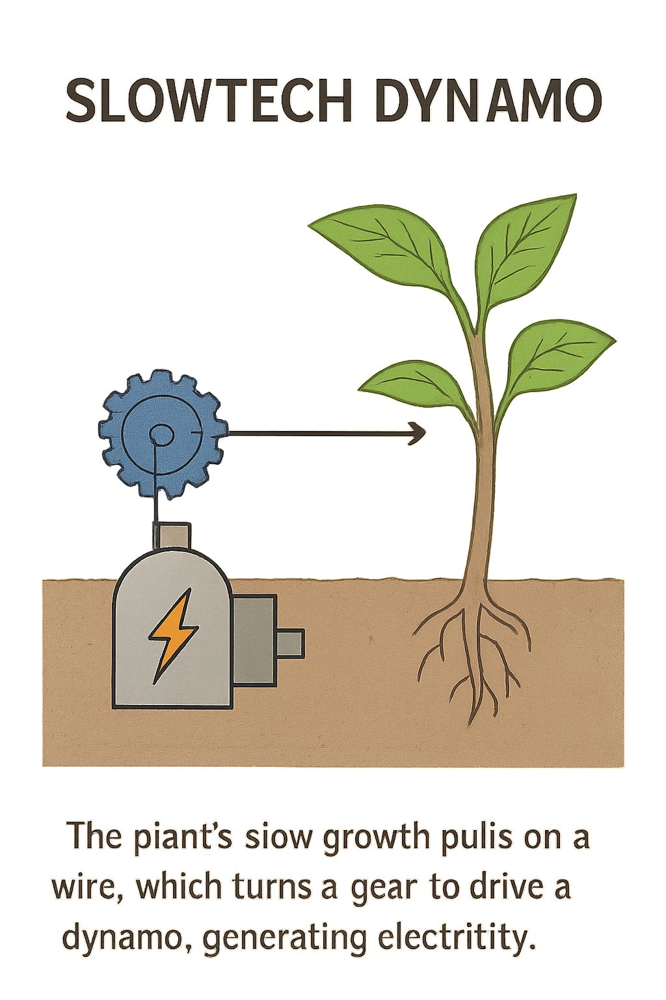

# 🌱⚡ Plant-Powered Dynamo

---

## 📖 General Description

**Plant-Powered Dynamo** is an original experiment blending art, engineering, and education:  
👉 *Harnessing the slow, natural growth of a living plant to mechanically drive a dynamo.*

The idea is simple yet poetic:  
- A plant grows vertically and laterally,  
- Each part (main stem and new branches) can exert a very small mechanical traction,  
- These tractions are accumulated via an ultra-lightweight, low-friction pulley system,  
- The resulting rotation slowly powers a miniature dynamo, producing an extremely small amount of electricity (millijoules/day at best).

> This project is first and foremost an **artistic and educational object**,  
> not a real-world energy solution: the energy extracted is minimal.

---

## 🔧 Operating Principle

1️⃣ A lightweight thread is attached to the main stem from the beginning.  
2️⃣ As the plant develops new branches,  
new threads are added to capture their mechanical growth as well.

3️⃣ These micro-forces are transmitted to a cumulative pulley system,  
which slowly converts them into continuous rotation for a miniature dynamo.

💡 **Goal: to visualize the symbolic conversion of a slow biological phenomenon into observable mechanical energy.**

---

## 🔔 Limitations

- ⚠️ Extremely low energy output:  
  No practical interest as a real energy production device.

- 🔬 Biological constraints:  
  The system must be designed to **apply no excessive mechanical load on plant tissues**,  
  otherwise it may hinder or stop growth.

---

## 🖼️ Simplified Illustration

[ Plant 🌱 ]───[ Ultra-light thread(s) ]───[ Pulley system ]───[ Dynamo ⚡ ]

---

## 🎯 Project Positioning

- **Artistic and educational exploration:**
  Visualizing the slow rhythms of biological growth,  
  Illustrating the relationship between solar energy, photosynthesis, and mechanical work.

- Conceptual, low-tech, experimental project.

---

## 📜 License & Governance

> This project is governed by a **dual license** model:  
> - **Open license for educational/personal experimentation:**  
  free access and reproduction for non-commercial, educational, experimental uses.

> - **Proprietary license / reserved rights for commercial/industrial adaptations:**  
  governed by the terms specified in the governance documentation available here:  
  [📂 Governance & Licensing Documents](https://github.com/f-buisson/Plant-powered_Dynamo/tree/main/governance)

🔔 Any commercial reproduction, industrial derivation, or adaptation in a professional context requires explicit authorization.

---

## 🤝 Contributions

Contributions, improvement suggestions, schematics, DIY prototypes are welcome:  
please respect the governance framework and the original spirit of the project.

---

### 🫶 Support this project

I release these projects as **open-hardware**, so anyone can study, adapt, and rebuild them freely.  
If you'd like to help the development continue and support new prototypes:  
👉 https://github.com/sponsors/f-buisson  
Even a symbolic contribution helps to:
- fund necessary materials
- develop and test prototypes
- cover software licensing fees (SolidWorks, etc.)

Thank you for your support ✦

---

## 📢 Disclaimer

> **Plant-Powered Dynamo is a hybrid, experimental work, fully assumed as such.  
> It illustrates a fascination for natural slow forces and biological cycles.  
> It is not intended to compete with any modern or optimized energy technology.**

---

# 🌱⚡ Plant-Powered Dynamo

---

## 📖 Description générale

**Plant-Powered Dynamo** est une expérimentation originale mêlant art, technique et pédagogie :  
👉 *Exploiter la lente croissance naturelle d’une plante vivante pour actionner mécaniquement une dynamo.*

L’idée est simple mais poétique :  
- Une plante croît verticalement et latéralement,  
- Chaque partie (tige principale et nouvelles branches) peut exercer une très faible traction mécanique,  
- Ces tractions sont cumulées via un système de poulies ultra-léger et à faible friction,  
- La rotation résultante alimente une dynamo qui génère un courant électrique extrêmement faible (millijoules/jour au mieux).

> Ce projet est avant tout un **objet artistique et éducatif**,  
> et non une solution énergétique réelle : la puissance extraite est minime.

---

## 🔧 Principe de fonctionnement

1️⃣ Un fil léger est attaché à la tige principale dès le début.  
2️⃣ À mesure que la plante développe de nouvelles branches,  
de nouveaux fils sont ajoutés pour capturer également leur croissance mécanique.

3️⃣ Ces micro-forces sont transmises à un système de poulies cumulatif  
puis converties en rotation continue ultra-lente d’une dynamo miniature.

💡 **Objectif : visualiser la conversion symbolique d’un phénomène biologique lent en énergie mécanique observable.**

---

## 🔔 Limitations

- ⚠️ Énergie extrêmement faible :  
  Aucun intérêt pratique en tant que production énergétique réelle.

- 🔬 Contraintes biologiques :  
  Le système doit être conçu pour **n’exercer aucune résistance excessive sur les tissus végétaux**,  
  sous peine de freiner / stopper la croissance.

---

## 🖼️ Illustration simplifiée

[ Plante 🌱 ]───[ Fil(s) ultra-légers ]───[ Poulie(s) ]───[ Dynamo ⚡ ]

---

## 🎯 Positionnement du projet

- **Exploration artistique et pédagogique :**
  Visualiser la lenteur des rythmes biologiques,
  Illustrer la relation entre énergie solaire, photosynthèse et travail mécanique.

- Projet conceptuel, low-tech, expérimental.

---

## 📜 Licence & gouvernance

> Ce projet est encadré par une **double licence** :  
> - **Open licence pédagogique / expérimentation personnelle :**  
  libre accès, libre reproduction pour des usages non commerciaux, éducatifs, expérimentaux.

> - **Licence propriétaire / droits réservés pour usages commerciaux / adaptations industrielles :**  
  régie par les termes précisés dans la documentation gouvernance disponible ici :  
  [📂 Governance & Licensing Documents]([https://github.com/f-buisson/Solidarity-Shopping-Cart-aka-Trolley/tree/main/governance](https://github.com/f-buisson/Plant-powered_Dynamo/tree/main/governance))

🔔 Toute reproduction commerciale, dérivation industrielle ou adaptation dans un cadre professionnel est soumise à autorisation explicite.

---

## 🤝 Contributions

Contributions, propositions d’amélioration, schémas, prototypes DIY sont les bienvenus :  
merci de respecter la gouvernance et l’esprit original du projet.

---

### 🫶 Soutenir ce projet

Je publie ces projets en **open-hardware**, pour que chacun puisse les comprendre, les adapter et les reconstruire librement.  
Si tu souhaites contribuer à leur évolution et à la création de nouveaux prototypes :  
👉 https://github.com/sponsors/f-buisson  
Chaque contribution (même symbolique) permet de :
- financer les matériaux nécessaires
- développer et tester les prototypes
- couvrir les licences logicielles (SolidWorks, etc.)

Merci pour ton soutien ✦

---

## 📢 Disclaimer

> **Plant-Powered Dynamo est une œuvre hybride, expérimentale, assumée comme telle.  
> Elle illustre la fascination pour les forces naturelles lentes et les cycles biologiques.  
> Elle n’a aucune vocation à concurrencer une technologie énergétique moderne ou optimisée.**
